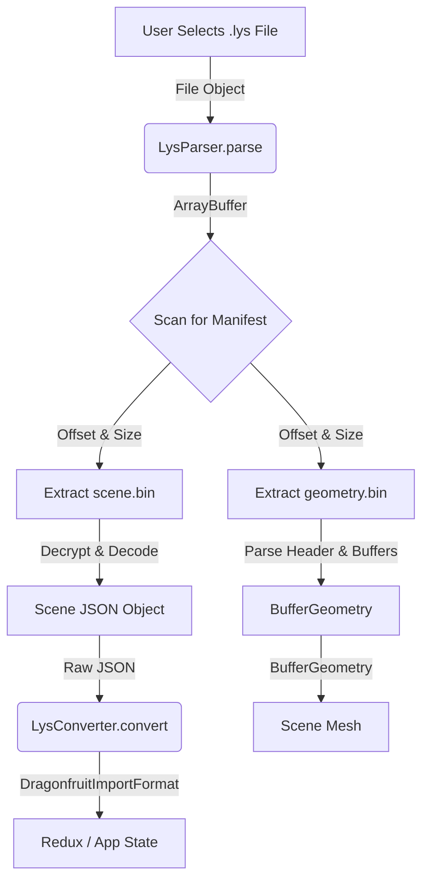

# LYS Import Feature Development Plan

## 1. Non-Technical Overview
**Goal:** Enable users to import Lychee Slicer (`.lys`) scene files directly into the application.

**Workflow:**
1.  User clicks an "Import LYS" button in the Top Bar.
2.  User selects a `.lys` file.
3.  The system reads the binary file, extracts the 3D model (STL), and parses the scene data (supports, transforms).
4.  The 3D model is loaded into the viewport.
5.  The system reconstructs the supports from the scene data, matching them to our internal support structures.

**Value:** Seamless migration from Lychee Slicer workflows, allowing users to leverage existing project files without external tools or Python scripts.

---

## 2. Execution Checklist
> **Agent Note:** Update this checklist after completing each step.

- [ ] **Phase 1: Binary Parsing Engine**
    - [ ] Create `src/utils/lys/LysParser.ts` structure.
    - [ ] Implement `findJsonHeader` to locate the internal manifest.
    - [ ] Implement `mangoFiles` parsing to find `scene.bin` and geometry offsets.
    - [ ] Implement `decryptBytes` (port from Python).
    - [ ] Implement `scene.bin` extraction and decoding (using `@msgpack/msgpack`).
    - [ ] Implement geometry header parsing (verify version & 20-byte offset).

- [ ] **Phase 2: Geometry Construction**
    - [ ] Implement `parseGeometry` to extract Indices and Vertices.
    - [ ] Convert binary data to `THREE.BufferGeometry` (Triangle List).
    - [ ] Create visual verification test (render the mesh).

- [ ] **Phase 3: Scene & Support Integration**
    - [ ] Create `useLysImport` hook to manage the import state.
    - [ ] Connect decoded Scene JSON to existing `LysConverter` logic.
    - [ ] Dispatch actions to add the Model to the Redux store.
    - [ ] Dispatch actions to add Supports to the Redux store.
    - [ ] Apply correct transforms (position, rotation) from Scene data.

- [ ] **Phase 4: UI Integration**
    - [ ] Add "Import LYS" button to `TopBar` with hidden file input.
    - [ ] Connect file input to `useLysImport`.
    - [ ] Add loading state feedback (toast or spinner).

---

## 3. Technical Specifications

### Reference Material (Source of Truth)
> **Agent Note:** Reference `3. LysConversion/` scripts for all logic.

### Technical Architecture
**The "LysParser" Engine**
A specialized static class `src/utils/lys/LysParser.ts` acts as the bridge.

**Data Flow**

### Detailed Implementation Specs

**Parsing Logic (`src/utils/lys/LysParser.ts`)**
*   `findJsonHeader(buffer: Uint8Array)`: Scans for `{"version"` signature and counts braces `{}`.
*   `decryptBytes(buffer: Uint8Array, key: string)`: Applies `(byte - keyChar) % 256` transformation.
*   `parseGeometry(buffer: ArrayBuffer)`:
    1.  **Check Header**: Verify first 4 bytes (Version).
    2.  **Apply Offset**: Jump to **Byte 20** (Critical!).
    3.  **Read Counts**: `n_indices` and `n_coords`.
    4.  **Read Indices**: `Uint32Array` triangle list.
    5.  **Read Vertices**: `Float32Array` coordinate list.
    6.  **Construct**: Return `THREE.BufferGeometry`.

**Integration Logic (`src/features/lys-import/useLysImport.ts`)**
*   **Input**: `File` object.
*   **Effect**:
    1.  Calls `LysParser.parse()`.
    2.  On success, dispatches `addModel` action with the geometry.
    3.  On success, calls `LysConverter.convert()` and dispatches `setSupports` action.
    4.  Applies Scene Transforms.
