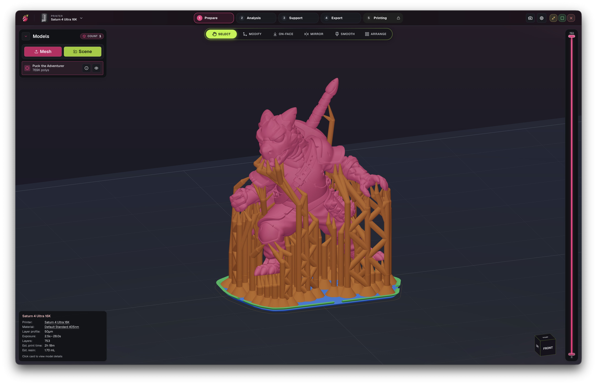

  

<a class="df-home-meta-chip df-home-project-chip" href="https://github.com/Open-Resin-Alliance" aria-label="An Open Resin Alliance Project">
  An Open Resin Alliance Project
</a>

<a class="df-home-meta-chip df-home-license-badge" href="https://github.com/Open-Resin-Alliance/DragonFruit/blob/main/LICENSE" aria-label="Licensed under AGPL-3.0-or-later">
  AGPL-3.0-or-later
</a>

Open-Source, High Performance Slicer for mSLA 3D Printers

    <a class="md-button md-button--primary" id="download-now" href="https://github.com/Open-Resin-Alliance/DragonFruit/releases/latest">Download Beta</a>
  <a class="md-button" href="./getting-started/installation/">View Docs</a>

Fetching the latest release from GitHub…

